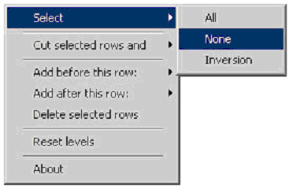

# shoveboxlist

A Hierarchical List Widget created by Mark Libbrecht, first published in the April 2001 edition of Foxtalk Magazine, entitled "You Can Push it Around in Your...ShoveBoxList".  

### Key features
> * Uses HTML, Javascript
> * No external libraries needed

### Original article features ( anno 2001 )
> * Written in FoxPro 6.0
> * Data bound to native VFP tables
> * use of Active X slider 
> * Shoving of the boxes plays a wav file (click sound) 
> * Visual and data manipulations by means of shortcut menu 

## UI

## Shortcut menu

